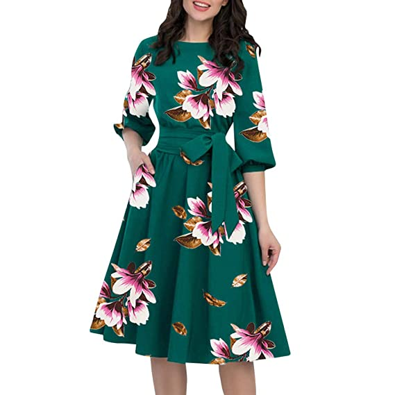
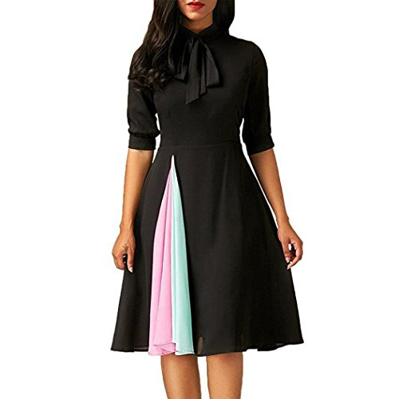
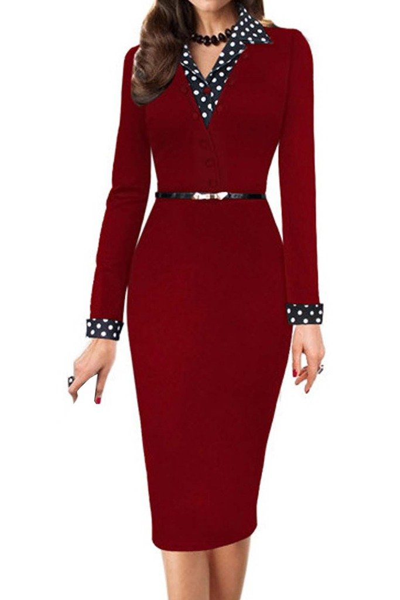

<!doctype html>

<html lang="en">
  <head>
    <meta charset="utf-8">
    <meta name="viewport" content="width=device-width, initial-scale=1">
    <title>Sanjana Arora
    </title>
    <link href="https://cdn.jsdelivr.net/npm/bootstrap@5.2.0-beta1/dist/css/bootstrap.min.css" rel="stylesheet" integrity="sha384-0evHe/X+R7YkIZDRvuzKMRqM+OrBnVFBL6DOitfPri4tjfHxaWutUpFmBp4vmVor" crossorigin="anonymous">
    
</head>
<body>
  
    
</body>

<nav class="navbar navbar-expand-lg text-bg-danger">
    

      <a class="navbar-brand" href="#">Sanjana</a>
      <button class="navbar-toggler" type="button" data-bs-toggle="collapse" data-bs-target="#navbarSupportedContent" aria-controls="navbarSupportedContent" aria-expanded="false" aria-label="Toggle navigation">
        
      </button>
      

        <ul class="navbar-nav me-auto mb-2 mb-lg-0">
          <li class="nav-item">
            <a class="nav-link active" aria-current="page" href="#">Home</a>
          </li>
          <li class="nav-item">
            <a class="nav-link" href="#">Link</a>
          </li>
          <li class="nav-item dropdown">
            <a class="nav-link dropdown-toggle" href="#" id="navbarDropdown" role="button" data-bs-toggle="dropdown" aria-expanded="false">
              Dropdown
            </a>
            <ul class="dropdown-menu" aria-labelledby="navbarDropdown">
              <li><a class="dropdown-item" href="#">Action</a></li>
              <li><a class="dropdown-item" href="#">Another action</a></li>
              <li>
</li>
              <li><a class="dropdown-item" href="#">Something else here</a></li>
            </ul>
          </li>
         
        </ul>
        <form class="d-flex" role="search">
          <input class="form-control me-2" type="search" placeholder="Search" aria-label="Search">
          <button class="btn btn-outline-success" type="submit">Search</button>
        </form>
      

    

</nav>
     
    

      <label for="exampleFormControlInput1" class="form-label style:col">Email address</label>
      <input type="email" class="form-control" id="exampleFormControlInput1" placeholder="name@example.com ">
    

    

      <label for="exampleFormControlTextarea1" class="form-label">Example textarea</label>
      <textarea class="form-control" id="exampleFormControlTextarea1" rows="3"></textarea>
    

    <label for="exampleColorInput" class="form-label">Color picker</label>
<input type="color" class="form-control form-control-color" id="exampleColorInput" value="#563d7c" title="Choose your color">

  

    

      
      

        <h5 class="card-title">Card title</h5>
        
This is a wider card with supporting text below as a natural lead-in to additional content. This content is a little bit longer.

      

      

        <small class="text-muted">Last updated 3 mins ago</small>
      

    

  

  

    

      
      

        <h5 class="card-title">Card title</h5>
        
This card has supporting text below as a natural lead-in to additional content.

      

      

        <small class="text-muted">Last updated 3 mins ago</small>
      

    

  

  

    

      
      

        <h5 class="card-title">Card title</h5>
        
This is a wider card with supporting text below as a natural lead-in to additional content. This card has even longer content than the first to show that equal height action.

      

      

        <small class="text-muted">Last updated 3 mins ago</small>
      

    

  

  

    

      
      

        <h5 class="card-title">Card title</h5>
        
This card has supporting text below as a natural lead-in to additional content.

      

      

        <small class="text-muted">Last updated 3 mins ago</small>
      

    

  

    
      
